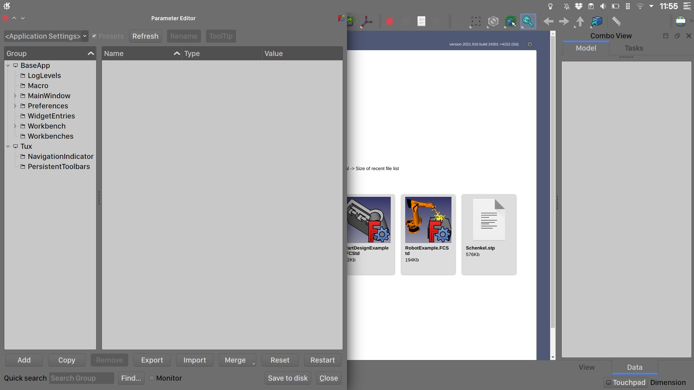
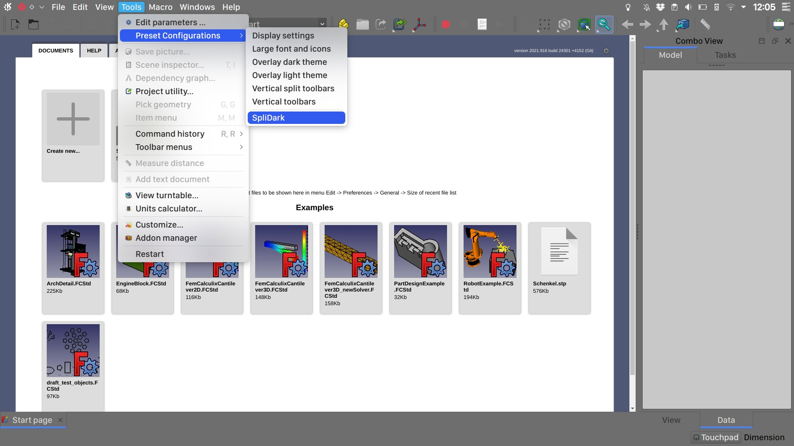

# FreeCAD-Preferences-Presets

## Video Tutorial
[LinkStage3] SplitDark and Pie menu's installing using the Preferences presets functionality.

At the moment, these preferences presets are intended to be used with Realthunder’s FreeCAD LinkStage3 development branch that can be downloaded from here: https://github.com/realthunder/FreeCAD_assembly3/releases

Both the preferences presets and the Linkstage3 release are considered unstable and intended for testing purposes so please do a backup of your FreeCAD configuration and don’t use it for important work.

You can already find builtin presets as of FreeCAD Linkstage3 2021.09.16 Release. They can be accessed in menu 'Tools -> Preset configurations.

Install:

-Backup your FreeCAD settings folder.

-For this to work you need Realthunder’s LinkStage3 from here: https://github.com/realthunder/FreeCAD_assembly3/releases

-Clone or download this github repo: https://github.com/oficinerobotica/FreeCAD-Preferences-Presets

-From the downloaded repo copy the "Gui"  and "settings" folders present in "src" to your  FreeCAD settings folder then restart FreeCAD

 OSX = /Users/[YOUR_USER_NAME]/Library/Preferences/FreeCAD/

 WINDOWS = C:\Users\[YOUR_USER_NAME]\AppData\Roaming\FreeCAD

 LINUX = /home/[YOUR_USER_NAME]/.FreeCAD/

Alternate install:
Download or clone [oficinerobotica/FreeCAD-Preferences-Presets](https://github.com/oficinerobotica/FreeCAD-Preferences-Presets) to a convenient location.

The main presets can be found in the FreeCAD-Preferences-Presets folder.
The Mods folder is reserved for experimentation and prsets there are intended to be merged with a previous configuration. Use those only if you know what are you dowing.

In FreeCAD, head over to Tools → EditParameters menu and click the Add button selecting the .FCParam file of your choice from the previously downloaded preferences pack.

To apply the the preferences pack select it in Tools → Preset Configurations

To revert to your previous configuration CTRL+Click the preset in Tools → Preset Configurations
