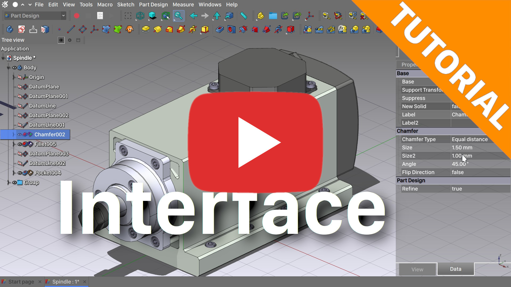

# FreeCAD-Preferences-Presets
 

## Video Tutorial
[LinkStage3] SplitDark and Pie menu's installing using the Preferences presets functionality.

At the moment, these preferences presets are intended to be used with Realthunder’s FreeCAD LinkStage3 development branch that can be downloaded from here: https://github.com/realthunder/FreeCAD_assembly3/releases

Both the preferences presets and the Linkstage3 release are considered unstable and intended for testing purposes so please do a backup of your FreeCAD configuration and don’t use it for important work.

You can already find builtin presets as of FreeCAD Linkstage3 2021.09.16 Release. They can be accessed in menu 'Tools -> Preset configurations.

## Install:

* Backup your FreeCAD settings folder.

* As a prerequisite, you must be using Realthunder’s experimental [LinkStage3](https://github.com/realthunder/FreeCAD_assembly3/releases) branch

* Clone or download this github repo: https://github.com/oficinerobotica/FreeCAD-Preferences-Presets

* Within the downloaded repo locate the `src` directory. It contains 2 important folders named `Gui` and `settings`

* Copy the `src/Gui` and `src/settings` folders to your local default FreeCAD settings folder. **Note:** reference the list below for your OS.

    >**macOS:** `/Users/[YOUR_USER_NAME]/Library/Preferences/FreeCAD/`
    >**Windows:** `C:\Users\[YOUR_USER_NAME]\AppData\Roaming\FreeCAD`
    >**Linux:** `/home/[YOUR_USER_NAME]/.FreeCAD/`

* Restart FreeCAD

## Alternate install:
Download or clone [oficinerobotica/FreeCAD-Preferences-Presets](https://github.com/oficinerobotica/FreeCAD-Preferences-Presets) to a convenient location.

The main presets can be found in the FreeCAD-Preferences-Presets folder.
The Mods folder is reserved for experimentation and prsets there are intended to be merged with a previous configuration. Use those only if you know what are you dowing.

In FreeCAD, head over to Tools → EditParameters menu and click the Add button selecting the .FCParam file of your choice from the previously downloaded preferences pack.

To apply the the preferences pack select it in Tools → Preset Configurations

## Revert changes
To revert to your previous configuration CTRL+Click the preset in Tools → Preset Configurations

## Feedback

Open a ticket in this repo or discuss in the FreeCAD forum.

## Donate

If you are benefitting from these efforts and want to show your appreciation/support, check out my [Patreon](https://www.patreon.com/oficinerobotica) or [Liberapay](https://liberapay.com/oficinerobotica/donate). Also consider donating to [@Realthunder's](https://github.com/realthunder) efforts on his [Patreon](https://www.patreon.com/thundereal).

## Author

Presets package authored by [@oficinerobotica](https://github.com/oficinerobotica).